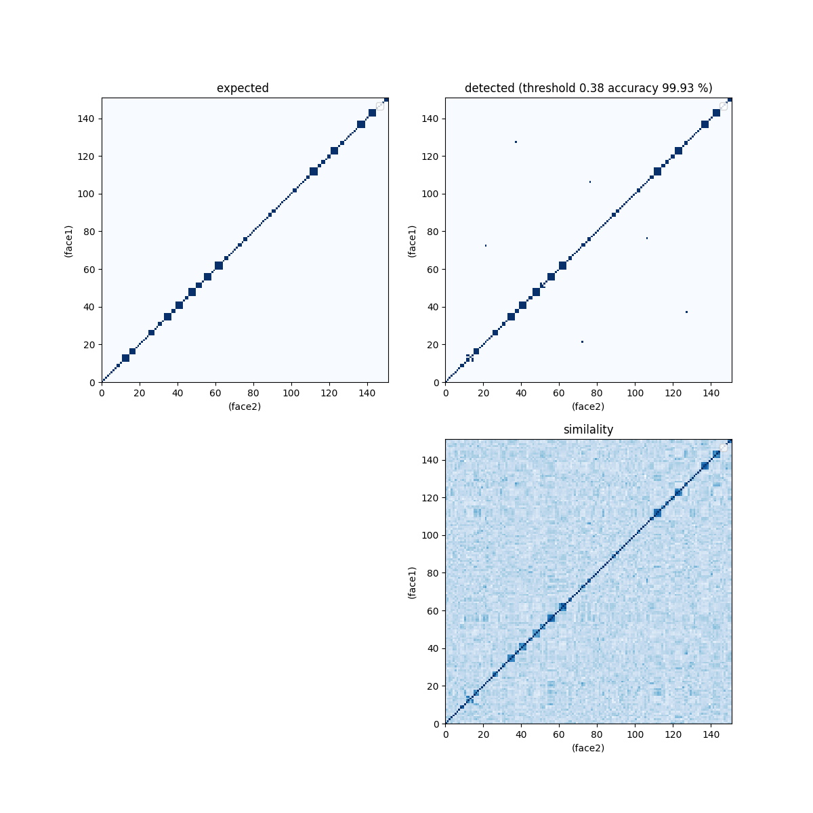
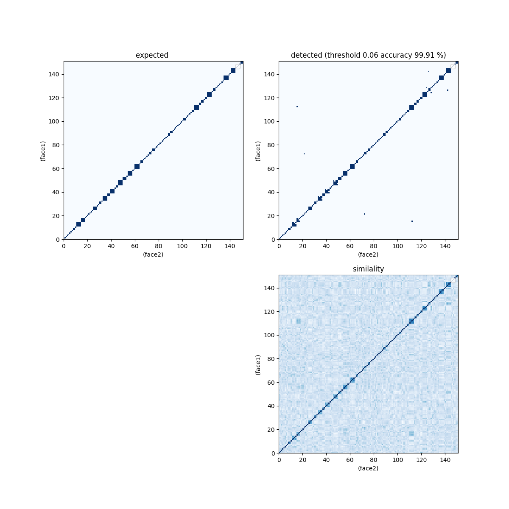

# Validate ArcFace and VGGFace2

## usage

Compute a confusion matrix from a set of face images. If you set `--skip`, we only use first 100 person.

```bash
$ python3 validation.py -i ./CASIA-WebFace --skip
$ python3 validation.py -i ./lfw-align-128 -a arcface --skip
$ python3 validation.py -i ./lfw-align-128 -a vggface2 --skip
```

## dataset structure

The dataset folder must be divided into folders for each person.

An example of the folder structure is shown below.

```
./CASIA-WebFace/0000045/001.jpg
./CASIA-WebFace/0000045/002.jpg
./CASIA-WebFace/0000099/001.jpg
```

## output

### arcface lfw 100 person



### vggface2 lfw 100 person



## dataset generation

Cut out a facial region from the dataset.

```bash
$ python3 validation_dataset_gen.py -i ./dataset/no_crop -o ./dataset/crop
```
