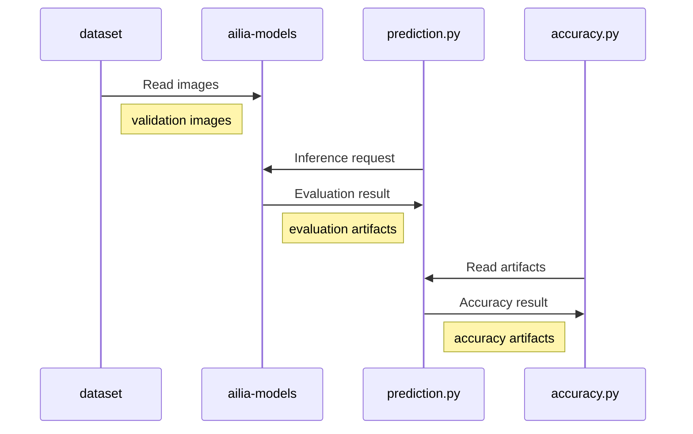

# TOP1 and TOP5 accuracy

Calculate TOP1 and TOP5 accuracy of image classification API

## Usage

### Architecture



### Dataset

Please download following files from kaggle.

https://www.kaggle.com/c/imagenet-object-localization-challenge/overview/description

(This subset linked from https://image-net.org/download.php)

```
imagenet_object_localization_patched2019.tar.gz : images
LOC_val_solution.csv.zip : annotation
LOC_synset_mapping.txt : class id to class no mapping
```

Unzip only val images.

```
tar -xvzf imagenet_object_localization_patched2019.tar.gz "*val*"
```

Put val files to following directoty.

```
data/imagenet/ILSVRC/Data/CLS-LOC/val/ILSVRC2012_val_00*.JPEG
data/imagenet/LOC_synset_mapping.txt
data/imagenet/LOC_val_solution.csv
```

### Prediction 

Predict labels using MODEL.

```
python3 prediction.py -m MODEL
```

### Calculate accuracy

Calculate accuracy using prediction result.

```
python3 accuracy.py -m MODEL
```

### TTA

By default, the aspect ratio is ignored and the image size is resized to 224x224. When 1-crop is enabled, it maintains the aspect ratio, resizes the short side to 256, and then crops to 224x224. (1-crop-testing) 10-crop is not implemented. For comparison with 1-crop, keep-aspect resizes the short side to 224 and then crops it.

### Example

- [example_onnx.sh](./example_onnx.sh)
- [example_tflite_resnet.bat](./example_tflite_resnet.bat)
- [example_tflite_mobilenet.bat](./example_tflite_mobilenet.bat)

## Evaluation Result

### ONNX

ImageNet 50000 Validation Images with ailia SDK 1.2.11.

|Model|Precision|TTA|TOP1|TOP5|
|-----|-----|-----|-----|-----|
|resnet50_pytorch|float|none|0.6852|0.8869|
|resnet50_pytorch|float|keep-aspect|0.7444|0.9222|
|resnet50_pytorch|float|1-crop|0.7532|0.9253|
|resnet50_chainer|float|none|0.7241|0.9103|
|resnet50_chainer|float|keep-aspect|0.7546|0.9265|
|resnet50_chainer|float|1-crop|0.7444|0.9226|

### tflite

ImageNet 50000 Validation Images with ailia TFLite Runtime 1.1.1.

|Model|Precision|TTA|TOP1|TOP5|
|-----|-----|-----|-----|-----|
|resnet50_keras|float|none|0.6755|0.8799|
|resnet50_keras|float|1-crop|0.7508|0.9217|
|resnet50_keras|int8|1-crop|0.7029|0.9188|
|resnet50_keras (recalib)|int8|1-crop|0.7467|0.9125|
|mobilenetv1_keras|float|1-crop|||
|mobilenetv1_keras|int8|1-crop|||
|mobilenetv1_keras (recalib)|int8|1-crop|||
|mobilenetv2_keras|float|1-crop|||
|mobilenetv2_keras|int8|1-crop|||
|mobilenetv2_keras (recalib)|int8|1-crop|||

The int8 model is calibrated with 4 images. The int8 (recalib) model is calibrated with 50,000 images.

ImageNet 50000 Validation Images with TensorFlow 2.7.

|Model|Precision|TTA|TOP1|TOP5|
|-----|-----|-----|-----|-----|
|resnet50_keras|float|none|0.6755|0.8799|
|resnet50_keras|float|1-crop|0.7508|0.9217|
|resnet50_keras (recalib)|int8|1-crop|0.7468|0.9121|

## Official Benchmark

|model|TTA|TOP1|TOP5|
|-----|-----|-----|-----|
|resnet50_pytorch|1-crop|0.7592|0.9281|
|resnet50_keras|1-crop|0.759|0.929|
|mobilenetv1_keras|1-crop|0.665|0.871|

Reference :
- https://pytorch.org/vision/stable/models.html
- https://keras.io/ja/applications/

