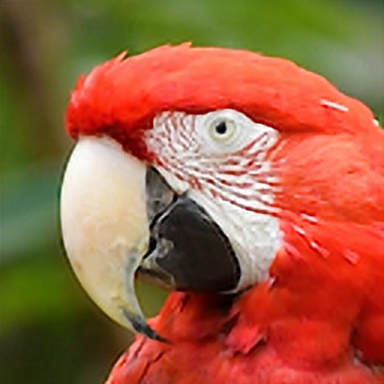
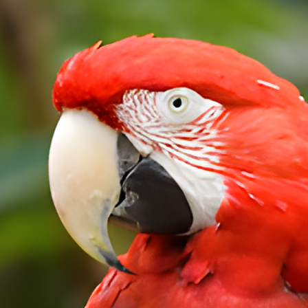
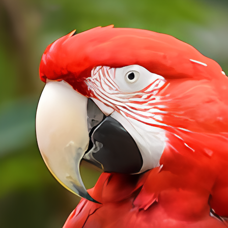

# Evaluation of super resolution

Evaluation script for ailia-models

## Evaluation settings

### Script

- [example-tflite.sh](example-tflite.sh)
- [example-onnx.sh](example-onnx.sh)

### Test dataset

|anime|photo|
|-----|-----|
|||
|from AXELL CORPORATION|from https://pixabay.com/videos/bird-parrot-nature-animal-colorful-46026/|

### Resolution

- 128x128 -> 384x384 (espcn) (tflite)
- 128x128 -> 512x512 (srresnet, edsr, han) (onnx)
- 128x128 -> 448x448 (real-esrgan) (onnx)

## Anime dataset

|bilinear|gradia|espcn|
|-----|-----|-----|
||||

|srresnet|edsr|han|
|-----|-----|-----|
||||

|real-esrgan (photo)|real-esrgan (anime)|
|-----|-----|
|||

## Photo dataset

|bilinear|gradia|espcn|
|-----|-----|-----|
||||

|srresnet|edsr|han|
|-----|-----|-----|
||||

|real-esrgan (photo)|real-esrgan (anime)|
|-----|-----|
|||